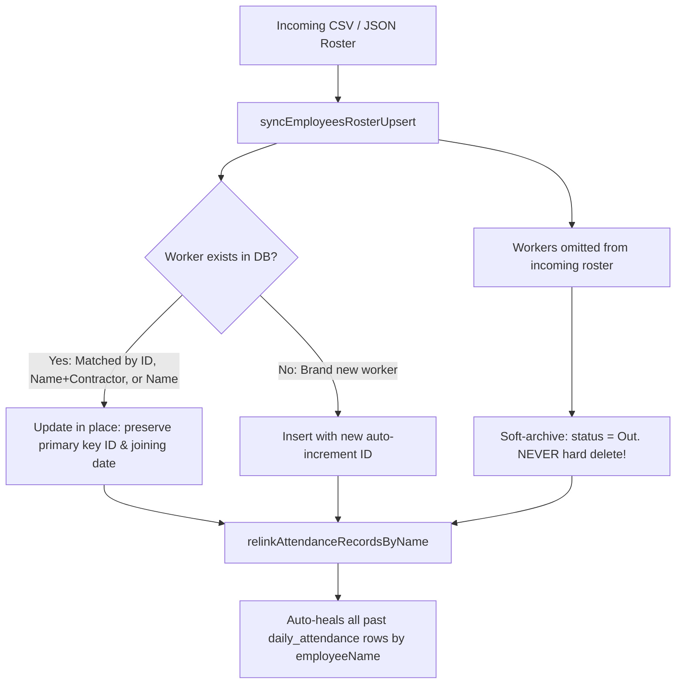

# CHANGES v2.4.0: Implementation of Issues #23 - Architecture & Disaster Recovery Walkthrough

---
## 1. Executive Summary & Root Cause Analysis

### What Happened to the Historical Records?
When an employee roster CSV / JSON was imported previously, the application performed a destructive `deleteAllEmployees()` followed by re-inserting employees with fresh auto-incremented database IDs (`employeeId = 1, 2, ...`).

- **Good News**: **Your past daily attendance records were NEVER deleted from the SQLite database.** The table `daily_attendance` preserves the historical logs along with worker names (`employeeName`), dates, departments, and roles.
- **The "Fracture"**: The attendance UI matched attendance rows using the foreign key `employeeId`. Because the newly inserted workers had brand new IDs, the foreign key link broke, causing workers to appear unmarked on historical dates.

---

## 2. Permanent Architectural Solution

We replaced the brittle delete-and-reinsert flow with an **In-Place Non-Destructive Upsert & Synchronization System** accompanied by an **Auto-Healing Re-linker** and a **Complete Database Disaster Recovery & Backup Suite**.

---

## 3. Changes Implemented

### 1. Auto-Healing & Non-Destructive Upsert
- [`ManpowerRepository.kt`](file:///c:/Users/rkhar/Documents/ANDROID%20APPS/BSPUtility/app/src/main/java/com/gratus/bsputility/data/repository/ManpowerRepository.kt):
  - **`relinkAttendanceRecordsByName()`**: Automatically scans all historical `daily_attendance` records in SQLite and re-links their `employeeId` and `employeeType` to the active employee ID matching `employeeName`.
  - **`syncEmployeesRosterUpsert()`**: Matches incoming roster entries by `id` $\rightarrow$ `(name + contractor)` $\rightarrow$ `name`. Updates fields in place without modifying existing primary keys. Omitted workers are marked with `status = "Out"` to preserve historical referential integrity.
  - Automatic re-linking runs in `ManpowerViewModel.init` on app startup and whenever a roster sync or backup restore occurs.

### 2. Full Database Backup & Disaster Recovery (Settings $\rightarrow$ Preferences)
- [`ManpowerViewModel.kt`](file:///c:/Users/rkhar/Documents/ANDROID%20APPS/BSPUtility/app/src/main/java/com/gratus/bsputility/ui/viewmodel/ManpowerViewModel.kt):
  - **`exportCompleteDatabaseBackupJson()`**: Exports an all-inclusive JSON snapshot containing:
    1. Employee library (`employees`)
    2. Contractor profiles (`contractors`)
    3. Master categories & custom fields (`configItems`)
    4. **All historical daily attendance records across ALL dates** (`dailyAttendance`)
    5. **All daily supervisor sign-off verifications** (`departmentVerifications`)
  - **`restoreCompleteDatabaseBackupJson()`**: Reconstitutes the entire database state from backup JSON and auto-heals relations.
- [`MasterDataScreen.kt`](file:///c:/Users/rkhar/Documents/ANDROID%20APPS/BSPUtility/app/src/main/java/com/gratus/bsputility/ui/screens/MasterDataScreen.kt):
  - Added the **"Full Database Backup & Disaster Recovery"** card in **Settings $\rightarrow$ Preferences**.
  - **Export Complete Database Backup (.JSON)**: Saves to `Documents/BSPManpower/BSP_Full_Database_Backup_[timestamp].json` and copies to clipboard.
  - **Restore Database / Disaster Recovery**: Dialog allowing file selection (`.json`) or raw text paste with safety confirmation.
  - Added maintenance button **"Re-link Attendance History by Worker Name"**.

---