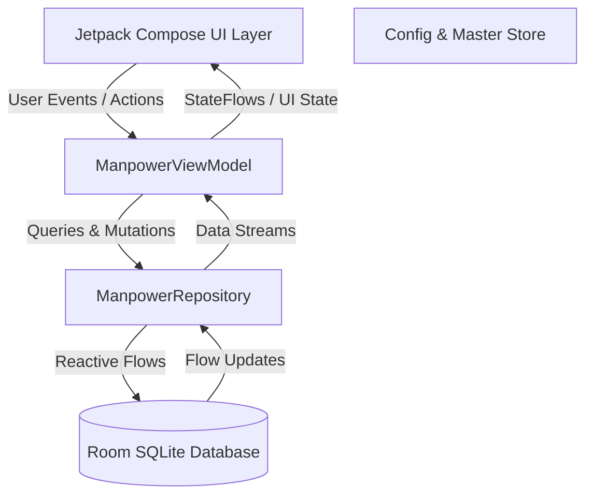

# BSP Manpower Utility — Technical & Architectural Codebase Documentation

**BSP Metatech LLP, Chakan Plant (Pune, Maharashtra)**  
*Industrial Contract Labour & Staff Attendance Management System*

---

## 1. Executive Summary & Product Purpose

**BSP Manpower Utility** is an offline-first Android application designed specifically for industrial manufacturing operations at BSP Metatech LLP in Chakan, Pune.

### Core Problems Solved
1. **Contractor Labour Volatility**: In heavy manufacturing (laser cutting, press work, fabrication, welding), contract labourers are supplied by multiple outside contractors (e.g. Apex Industrial Services, Chakan Workforce Solutions) and are assigned dynamically to different departments, shifts, and units daily.
2. **Permanent vs. Daily Role Separation**: Overriding an employee's daily assignment (e.g. a welder temporarily assisting laser cutting for a single shift) must **never** corrupt their master profile.
3. **Rigorous Floor Verification**: Before daily headcount reports are sent to executive management, department heads must physically sign off and verify that assigned labourers are physically present on their shop floors before 11:00 AM.
4. **Instant WhatsApp & CSV Reporting**: Floor supervisors and HR trainees require one-tap formatted WhatsApp reports and CSV summaries for leadership updates.

---

## 2. Architecture & Technology Stack

The app follows standard Android Modern Architecture principles with an **Offline-First MVVM** pattern powered by Jetpack Compose and Room.



### Technology Highlights
- **Language & Runtime**: Kotlin 2.0+ targeting Java 21.
- **UI Toolkit**: Jetpack Compose with Material Design 3 (`androidx.compose.material3`).
- **Database**: Room Persistence Library (`androidx.room:room-ktx`) with SQLite.
- **Asynchronous Flow**: Kotlin Coroutines & `StateFlow` reactive pipelines.
- **System Insets**: Android edge-to-edge support with `enableEdgeToEdge()` and Compose `WindowInsets`.
- **Testing**: Robolectric, AndroidX Compose Test, JUnit 4, and Roborazzi screenshot testing.

---

## 3. Directory & File Organization

```
BSPUtility/
├── app/
│   ├── src/
│   │   ├── main/
│   │   │   ├── java/com/gratus/bsputility/
│   │   │   │   ├── MainActivity.kt                 # Application entry point, scaffold, bottom nav
│   │   │   │   ├── data/
│   │   │   │   │   ├── db/
│   │   │   │   │   │   ├── AppDatabase.kt          # Room database definition & initial seeder
│   │   │   │   │   │   └── EmployeeDao.kt          # Room DAO with reactive Flow queries
│   │   │   │   │   ├── models/
│   │   │   │   │   │   └── Employee.kt             # Domain entities & summary data classes
│   │   │   │   │   └── repository/
│   │   │   │   │       └── ManpowerRepository.kt   # Clean repository layer abstracting DAO
│   │   │   │   ├── ui/
│   │   │   │   │   ├── components/
│   │   │   │   │   │   ├── AddConfigDialog.kt            # Taxonomy item creation/editing modal
│   │   │   │   │   │   ├── AddContractorDialog.kt        # Contractor creation/editing modal
│   │   │   │   │   │   ├── AddEditEmployeeDialog.kt      # Full master employee form modal
│   │   │   │   │   │   ├── AppNavigationBar.kt           # 5-tab NavigationBar & NavigationTab enum
│   │   │   │   │   │   ├── AttendanceCard.kt             # Daily worker row item with toggle buttons
│   │   │   │   │   │   ├── AttendanceLabourDialog.kt     # Labour daily override dialog
│   │   │   │   │   │   ├── AttendanceStaffDialog.kt      # Staff in-time & remarks dialog
│   │   │   │   │   │   ├── BreakdownCard.kt              # Key-value statistical breakdown card
│   │   │   │   │   │   ├── CollapsibleSection.kt         # Expandable accordion component
│   │   │   │   │   │   ├── DateNavigationBar.kt          # Day navigator with DatePicker modal
│   │   │   │   │   │   ├── DepartmentAllocationCard.kt   # Department staffing summary table
│   │   │   │   │   │   ├── DepartmentVerificationCard.kt # Floor supervisor sign-off card
│   │   │   │   │   │   ├── JsonBackupDialog.kt           # JSON/CSV roster backup & restore modal
│   │   │   │   │   │   ├── LabourGroupedList.kt          # Grouped labourer breakdown by department
│   │   │   │   │   │   ├── MetricCounter.kt              # Hero statistics counter tile
│   │   │   │   │   │   ├── PasteImportDialog.kt          # Bulk employee name import modal
│   │   │   │   │   │   ├── RestoreFullDatabaseDialog.kt  # Full database disaster recovery modal
│   │   │   │   │   │   ├── RoosterEmployeeCard.kt        # Master roster employee display card
│   │   │   │   │   │   ├── StatusBadge.kt                # Status & presence indicator pills
│   │   │   │   │   │   ├── TopBrandBar.kt                # Top header bar with brand logo & insets
│   │   │   │   │   │   └── WorkersListDialog.kt          # Dialog displaying active workers in group
│   │   │   │   │   ├── preview/
│   │   │   │   │   │   └── PreviewData.kt          # Mock data for Compose previews
│   │   │   │   │   ├── screens/
│   │   │   │   │   │   ├── AttendanceScreen.kt     # Live daily attendance & search
│   │   │   │   │   │   ├── MasterDataScreen.kt     # Contractors & lookup configurations
│   │   │   │   │   │   ├── ReportsScreen.kt        # WhatsApp & CSV export generation
│   │   │   │   │   │   ├── RoosterScreen.kt        # Master employee library & paste import
│   │   │   │   │   │   └── VerificationScreen.kt   # Department head physical sign-offs
│   │   │   │   │   ├── theme/
│   │   │   │   │   │   ├── Color.kt                # Industrial Navy, Amber, Teal, Slate tokens
│   │   │   │   │   │   ├── Theme.kt                # M3 LightColorScheme & DarkColorScheme
│   │   │   │   │   │   └── Type.kt                 # Typography definitions
│   │   │   │   │   └── viewmodel/
│   │   │   │   │       └── ManpowerViewModel.kt    # Core business logic & combined states
│   │   │   │   └── res/
│   │   │   │       ├── values/
│   │   │   │       │   ├── colors.xml                  # Industrial native color resources
│   │   │   │       │   ├── strings.xml                 # App strings
│   │   │   │       │   └── themes.xml                  # Base window theme
│   │   │   │       └── AndroidManifest.xml
│   │   │   └── test/                                   # Host unit & screenshot tests
│   │   └── build.gradle.kts                            # App-level build script
│   ├── gradle/
│   │   ├── libs.versions.toml                          # Version catalog
│   │   └── wrapper/                                    # Gradle wrapper configuration
│   └── settings.gradle.kts
```

---

## 4. Domain Entities & Database Schema

The SQLite schema consists of 5 core entities managed by `AppDatabase`:

### 4.1. `Employee` (`employees` table)
Master record representing permanent staff, contract labourers, or housekeeping personnel:
- `id: Long` (Auto-generated Primary Key)
- `name: String`: Employee full name.
- `type: String`: Constant (`EmployeeTypes.STAFF`, `LABOUR`, `HOUSEKEEPING`).
- `status: String`: Lifecycle state (`Active`, `Debarred`, `Out`).
  - `Active`: Present in everyday attendance tracking.
  - `Debarred`: Temporary disciplinary or safety suspension; remains highlighted on daily lists.
  - `Out`: Exited company; retained in library records but omitted from daily active roll calls.
- `dateAdded: String`: ISO date string when registered.
- `permanentDepartment: String`: Default assigned department (e.g. "Welding Shop").
- `designation: String`: Staff designation (e.g. "HR Trainee", "Production Supervisor").
- `contractorId: Long?`: Foreign reference to supplying agency.
- `contractorName: String`: Cached agency name.
- `defaultWorkRole: String`: Default trade (e.g. "Welder", "Laser Operator", "Helper").
- `defaultUnit: String`: Plant location ("Unit I", "Unit II", "Unit III").
- `defaultShift: String`: Default working shift ("Shift A", "Shift B", "General").
- `permanentRemarks: String`: Ongoing notes or disciplinary history.
- `customFieldsJson: String`: Extensible JSON blob for client-defined attributes.

### 4.2. `DailyAttendance` (`daily_attendance` table)
Represents a snapshot record for an employee on a specific calendar date (`date = YYYY-MM-DD`):
- `id: Long` (Primary Key)
- `date: String`: Date of attendance.
- `employeeId: Long`: Associated employee.
- `isPresent: Boolean`: True if marked present.
- **Daily Overrides**:
  - `dayDepartment`: Today's department assignment.
  - `dayWorkRole`: Today's actual activity.
  - `dayContractorName`: Today's contractor.
  - `dayUnit`: Today's assigned plant unit.
  - `dayShift`: Today's assigned shift.
  - `attendanceTime`: For staff members (e.g. "08:45 AM").
  - `dayRemarks`: Specific shift remarks (e.g. "Transferred to laser maintenance").
  - `updatedAt: Long`: Epoch timestamp of last edit.

### 4.3. `DepartmentVerification` (`department_verifications` table)
Tracks floor-level verification by department supervisors:
- `date: String`: Calendar date.
- `departmentName: String`: Shop department.
- `isVerified: Boolean`: Sign-off status.
- `verifiedByStaffId: Long?`: Staff supervisor who verified.
- `verifiedByStaffName: String`: Supervisor display name.
- `verifiedAtTime: String`: Timestamp of physical sign-off (e.g. "10:15 AM").
- `remarks: String`: Supervisor notes.

### 4.4. `Contractor` (`contractors` table)
Supplying agencies providing contract labour:
- `name: String`: Contractor title (e.g. "Apex Industrial Services").
- `contactPerson: String`: Agency supervisor contact.
- `phone: String`: Mobile number.
- `notes: String`: Speciality trades supplied.

### 4.5. `ConfigItem` (`config_items` table)
User-configurable taxonomy items:
- `category: String`: Category discriminator (`DEPARTMENT`, `DESIGNATION`, `UNIT`, `LABOUR_ROLE`, `CUSTOM_FIELD`).
- `name: String`: Value label.
- `extraType: String`: Type for custom fields (`TEXT`, `NUMBER`, `DROPDOWN`, `DATE`, `BOOLEAN`).

---

## 5. State Management & ViewModel Logic

`ManpowerViewModel` acts as the central single source of truth for the entire UI.

### 5.1. Reactive State Combination
The screen states are synthesized reactively through Kotlin's `combine` operator:
- **`effectiveAttendanceItems`**:
  Combines `allEmployees`, `_attendanceStream`, `attendanceSearchQuery`, `attendanceFilterType`, `attendanceFilterContractor`, and `attendanceFilterDepartment`.
  It computes an `EmployeeAttendanceItem` that merges master defaults with day-specific overrides without persisting side effects until the user explicitly commits changes.
- **`manpowerSummary`**:
  Aggregates total staff present, contract labour, housekeeping, contractor breakdowns, department allocations, unit distributions, and verification completion ratios.

### 5.2. Date Traversal
- `selectPreviousDay()` / `selectNextDay()` / `selectDate(String)` updates `_selectedDate`.
- Changing `_selectedDate` automatically re-triggers Room queries for both `daily_attendance` and `department_verifications` via reactive Flow collection.

### 5.3. Bulk Operations & Reporting
- **`markAllActivePresent()`**: Rapidly marks all non-out employees present with their default department and shift settings.
- **`generateMorningReportWhatsApp()`**: Assembles structured WhatsApp text formatting headers, contractor tallies, department allocations, and sign-off status.
- **`generateSummaryCsv()` & `generateDetailedCsv()`**: Produces RFC-4180 compliant CSV exports for spreadsheet ingestion.
- **`importPastedNames(...)`**: Parses newline-separated employee lists with regex cleanup, generating master library records in a single batch.

---

## 6. Screen Catalog & Navigation Flow

The top-level `MainActivity` renders a 5-tab `NavigationBar`:

| Tab | Screen | Key Capabilities |
| :--- | :--- | :--- |
| **Attendance** | `AttendanceScreen` | Quick headcount card, 48dp rapid toggle buttons, search/filter bar, detailed assignment dialog. |
| **Rooster** | `RoosterScreen` | Accordion grouping (Staff, Labour, Housekeeping), quick paste import, full JSON backup/restore, FAB add. |
| **Verify** | `VerificationScreen` | Department progress bar, supervisor dropdown sign-offs, expandable labour list verification. |
| **Reports** | `ReportsScreen` | Morning headcount hero card, 1-tap WhatsApp copy/share, CSV downloads, multi-category breakdown cards. |
| **Settings** | `MasterDataScreen` | CRUD for Contractors, Departments, Designations, Units, Labour Roles, and Custom Fields. |

### 6.1. Modular Component Architecture (`com.gratus.bsputility.ui.components`)
To ensure high maintainability and testability, all screens are modularized with composables extracted into dedicated files:

- **Navigation & Brand Bars**:
  - `TopBrandBar.kt`: Standardized top header with company branding (`BSP Metatech LLP`) and status bar padding.
  - `AppNavigationBar.kt`: Bottom navigation bar with 5 tabs and `NavigationTab` route definitions.
  - `DateNavigationBar.kt`: Date step navigation bar with DatePicker calendar modal.
- **Attendance & Cards**:
  - `AttendanceCard.kt`: Daily attendance card with 48dp rapid toggle button, time/remarks preview, and touch feedback.
  - `RoosterEmployeeCard.kt`: Roster library card with status badges, metadata tags, and edit/delete actions.
  - `DepartmentVerificationCard.kt`: Shop floor sign-off card with verification progress, supervisor selector, and fast "Same as Yesterday" actions.
  - `StatusBadge.kt`: Clean chip indicators for Active, Debarred, Out, Present, and Absent states.
- **Reports & Metric Visuals**:
  - `MetricCounter.kt`: KPI count block for Staff, Labour, Housekeeping, and Total headcount.
  - `BreakdownCard.kt`: Multi-row tabular card for contractor and unit breakdowns.
  - `DepartmentAllocationCard.kt`: Two-column department headcount and labour-breakdown table with drill-down modal trigger.
  - `LabourGroupedList.kt`: Department-grouped labour lists for inspection and floor verification.
- **Modals & Dialogs**:
  - `AttendanceLabourDialog.kt` & `AttendanceStaffDialog.kt`: Fine-grained assignment override dialogs.
  - `AddEditEmployeeDialog.kt`: Form dialog for creating/updating staff and labour roster records.
  - `PasteImportDialog.kt`: Batch import modal for pasting raw names list.
  - `JsonBackupDialog.kt`: Roster JSON/CSV export and import modal.
  - `AddContractorDialog.kt`: Contractor/agency creation and editing modal.
  - `AddConfigDialog.kt`: Taxonomy creation modal for Departments, Roles, Units, Shifts, and Custom Fields.
  - `RestoreFullDatabaseDialog.kt`: Disaster recovery full database backup restore modal.
  - `WorkersListDialog.kt`: Modal listing all workers assigned to a specific department.
  - `CollapsibleSection.kt`: Expandable/collapsible container for grouped lists.

---

## 7. Theming, Color Tokens & Insets Architecture

### 7.1. Industrial Manufacturing Color System
The visual identity reflects heavy precision engineering:
- **Primary**: `IndustrialNavy900` (`#0F172A`) in Light theme; `IndustrialBlue500` (`#3B82F6`) in Dark theme.
- **Secondary**: `IndustrialAmber600` (`#D97706`) in Light theme; `IndustrialAmber500` (`#F59E0B`) in Dark theme.
- **Tertiary**: `IndustrialTeal600` (`#0D9488`) in Light theme; `IndustrialTeal400` (`#2DD4BF`) in Dark theme.
- **Status Presence**: `PresentGreen` (`#10B981`) for Present / Verified, `AbsentRed` (`#EF4444`) for Absent.
- **Debarred Alert**: `StatusDebarred` (`#D97706`) with tinted borders.

### 7.2. Edge-to-Edge System Bars & Insets
- **Top Brand Bar**: Uses `statusBarsPadding()` on its content row, allowing the dark navy background to extend behind the status bar while safeguarding titles and icons from notch/clock overlaps.
- **Status Bar Icon Contrast**: Enforces `SystemBarStyle.dark(...)` so status bar indicators remain white on the permanently dark navy brand bar.
- **Bottom Navigation Bar**: Accounts for system navigation gesture bars using `NavigationBarDefaults.windowInsets`.

---

## 8. Build, Testing & Verification

- **Gradle Build**: Execute `./gradlew.bat assembleDebug` to compile the debug APK.
- **Unit & Robolectric Tests**: Execute `./gradlew.bat testDebugUnitTest` to run headless unit and Compose component tests.
- **Screenshot Verification**: Roborazzi test suite renders native pixel comparisons to ensure UI consistency.
